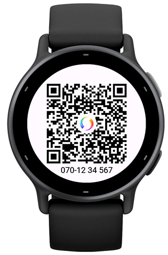

# Garmin Swish QR

A widget (with glance support) to show your Swish QR code on your watch! Built
together with [swish-qr-proxy] which is a proxy to Swish's public API for
generating QR codes.

> [!IMPORTANT]
> This app is backed by a public API hosted by [Swish]. This API can at any time
> be removed, changed or blocked for whatever reason which will result in this
> app not working untul an alternative solution is fixed.

## Usage

Open the settings and enter your desired configuration. Number is required but
all other settings are optional.

Once saved, the image will be saved on your device and shown when you start the
widget. A new image will only be fetched and generated when settings are
changed.

## Disclaimer

This app is not affiliated with [Swish]. Swish and its logo are trademarks or
registered trademarks of Swish. All rights to the name, logo, and API belong to
Swish.

[Swish]: https://www.swish.nu
[swish-qr-proxy]: https://github.com/bombsimon/swish-qr-proxy
